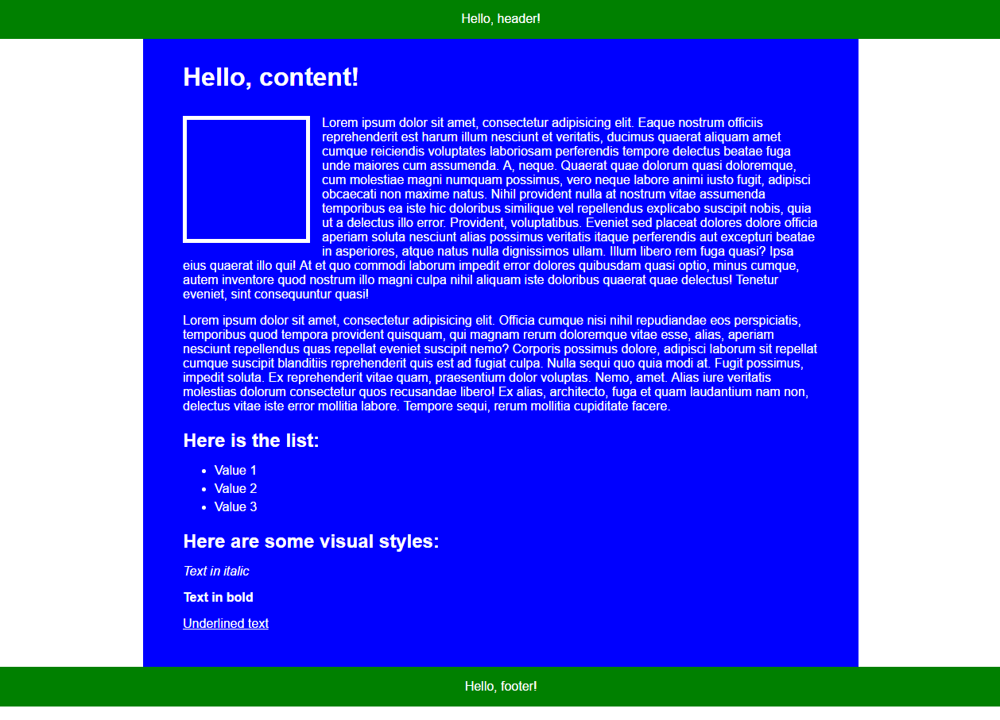

# 1 lesson

## Tasks
Learn how to:
1. Work with basic structure of HTML document.
2. Add elements (tags) to HTML document.
3. Add CSS files to HTML document.
4. Use a few simple selectors and properties.

## Result



## Reference

### HTML
* \<!DOCTYPE html>
* \<html>, \<head>, \<body>
* \<title>, \<meta>
* \<link rel="stylesheet" type="text/css" href="index.css" />
* \<div>, \<p>, \<h1>, \<h2>, \<ul>, \<li>
* \<i>, \<b>, \<u>
* class="header"

#### Example
```html
<div class="content">
    <p>Lorem ipsum</p>
    <h2>List</h2>
    <ul>
        <li>Item 1</li>
        <li>Item 2</li>
    </ul>
</div>
```

### CSS

#### Selectors

* \*
* body
* .content
* .header, .footer
* .content h1
* ul > li

#### Properties 

* margin, padding
* border
* width, height, min-height
* box-sizing
* float
* font-family, font-size, line-height
* text-align
* background, color

#### Useful tricks
* margin: 0 auto; -  centering block elements horizontally

#### Examples
```css
.header,
.footer {
    height: 50px;
    line-height: 50px;
    text-align: center;
    background: green;
    color: #fff;
}
```

## Useful URLs
[W3C HTML5](https://www.w3schools.com/html/)  
[W3C CSS](https://www.w3schools.com/css/default.asp)
