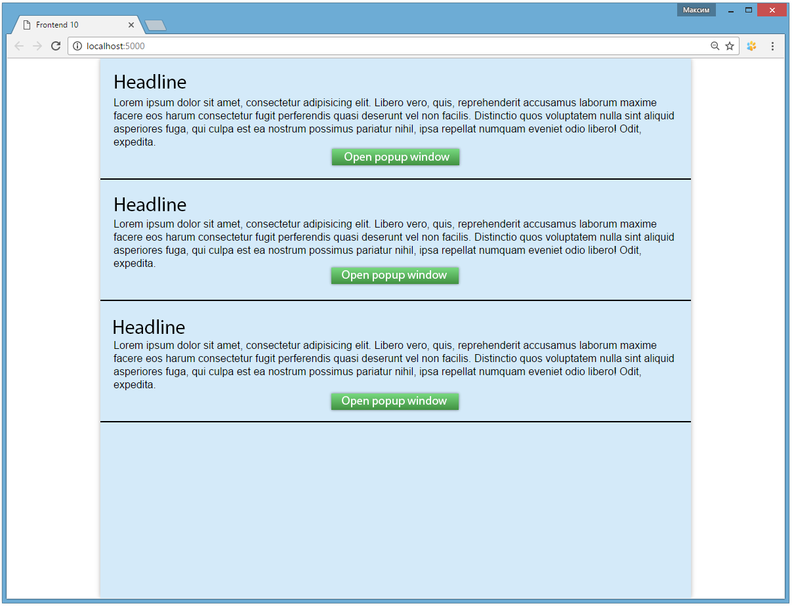
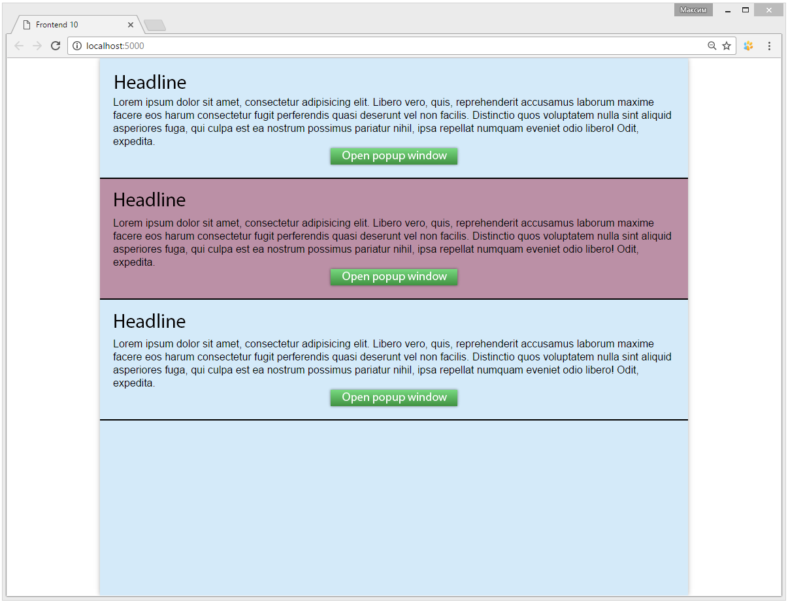
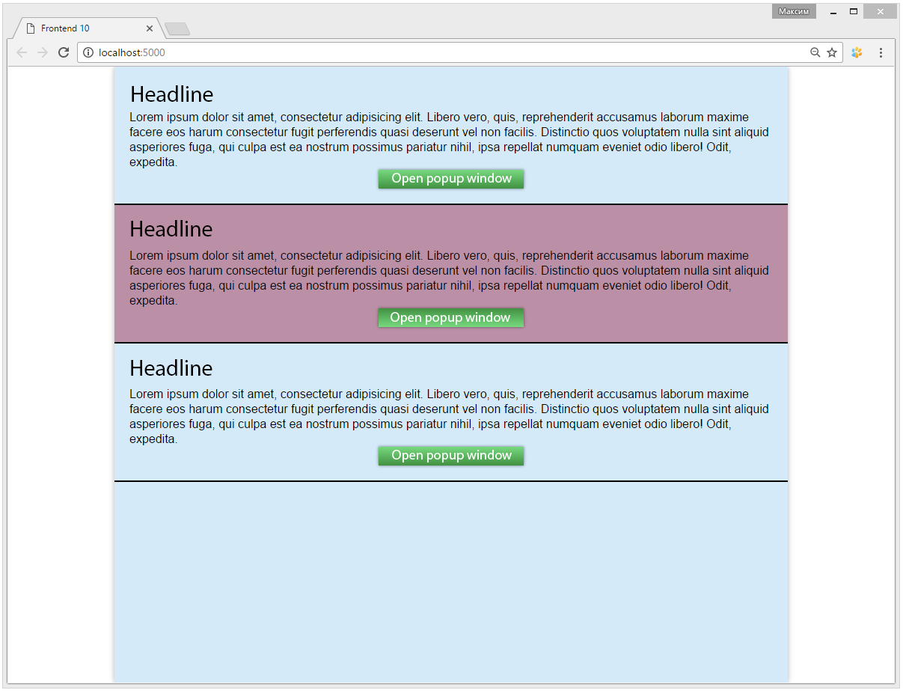
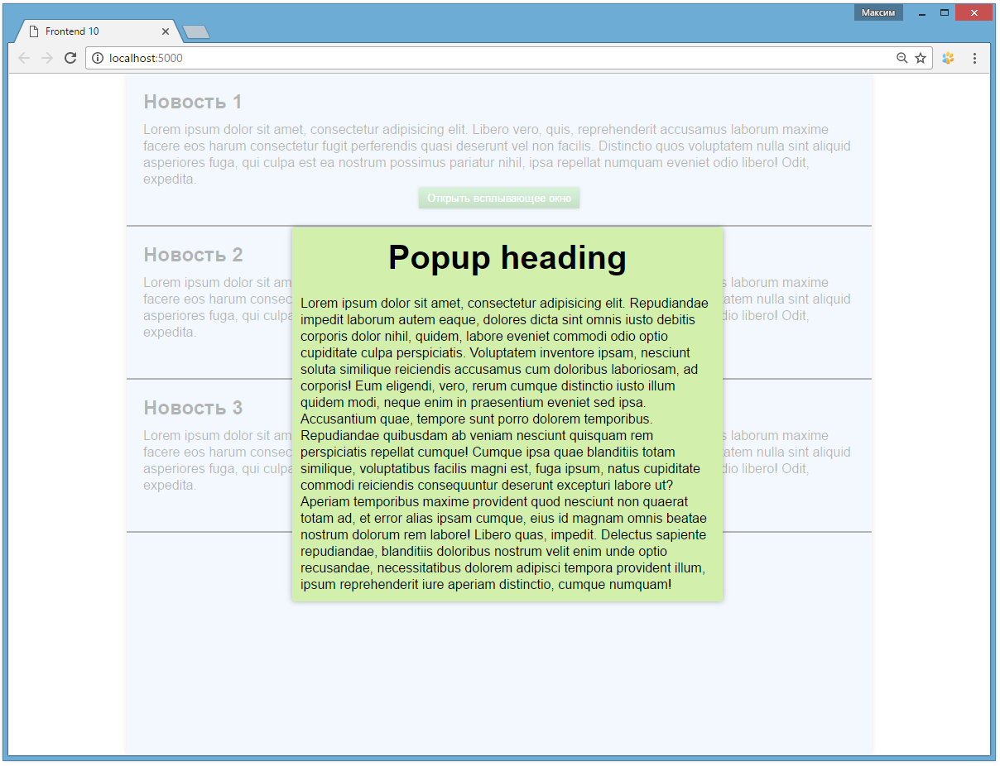
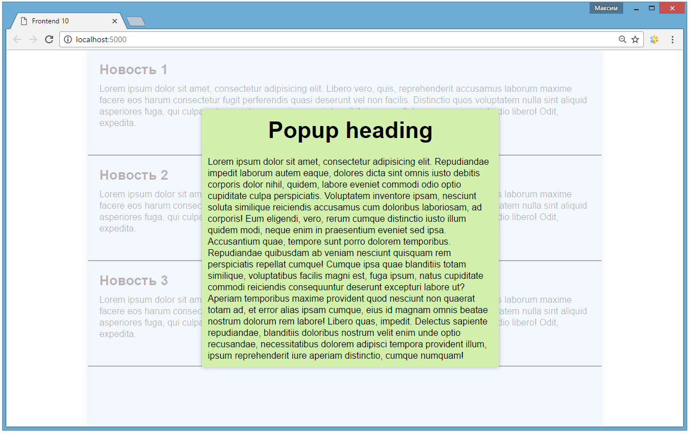
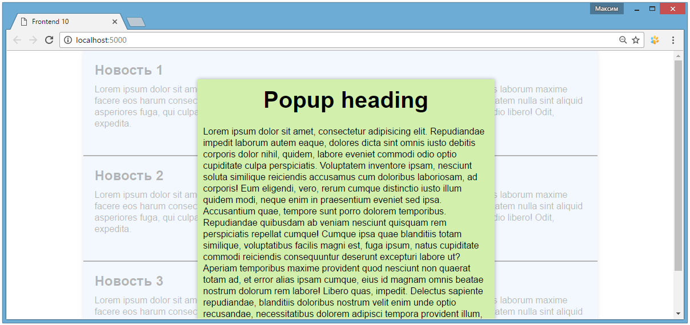

# Practice 10
## Objective
1. Learn to use JavaScript for solving applied tasks for web pages development.
2. Get familiar with CSS animation.

## Result
You have to implement a news list that contains visible short and hidden detailed versions of news. Detailed news shows up in a popup window after a click on a specific button.

*Pic 1. Look at the shades and gradients.*

*Pic 2. When hovering on news, it smoothly changes its background color (using the "transition" property) over half a second. When moving the cursor away, the news changes its background color back.*

*Pic 3. When clicking on the button, its gradient's colors get inverted. When releasing the button, the gradient comes back to the initial state.*

*Pic 4. Clicking on the button opens a popup window located in the center of the screen. The window content is taken from a neighboring to the button element that contains the "detailed news version" but is hidden on the page. To close the window, you should click anywhere in the area that surrounds the window, but clicking on the window itself should not close it. Showing up and closing happens smoothly over half a second.*

*Pic 5. When changing the browser window size, the popup window should remain centered both vecrtically and horizontally.*

*Pic 6. If the browser window height is too narrow (less than the popup window height + 100px), the behavior changes: the popup window is no longer centered vertically, but fixed in one place (with 50px top margin), which allows to read all the content of the popup window with the use of vertical scrollbar.*

## Reference

### CSS
* transition (transition-property, transition-duration)
* animation (animation-name, animation-duration)
* animation-fill-mode
* @keyframes
* (background) linear-gradient()

### JavaScript

#### Element
* clientHeight
* clientWidth

#### Events
* (window) resize

## Sources

[https://developer.mozilla.org/en-US/docs/Web/CSS/CSS_Transitions/Using_CSS_transitions](https://developer.mozilla.org/en-US/docs/Web/CSS/CSS_Transitions/Using_CSS_transitions)

[http://www.w3schools.com/css/css3_animations.asp](http://www.w3schools.com/css/css3_animations.asp)

[https://developer.mozilla.org/en-US/docs/Web/CSS/linear-gradient](https://developer.mozilla.org/en-US/docs/Web/CSS/linear-gradient)