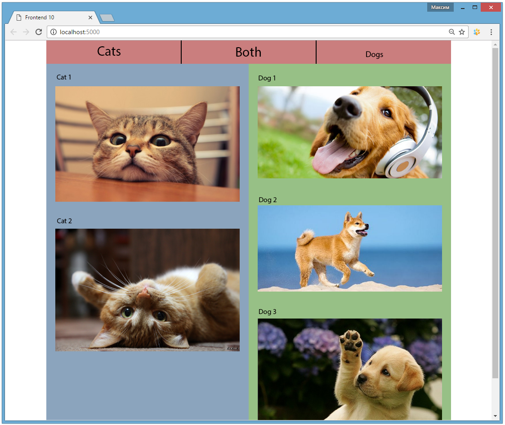
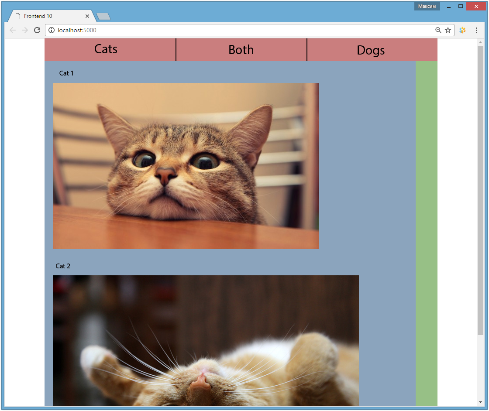
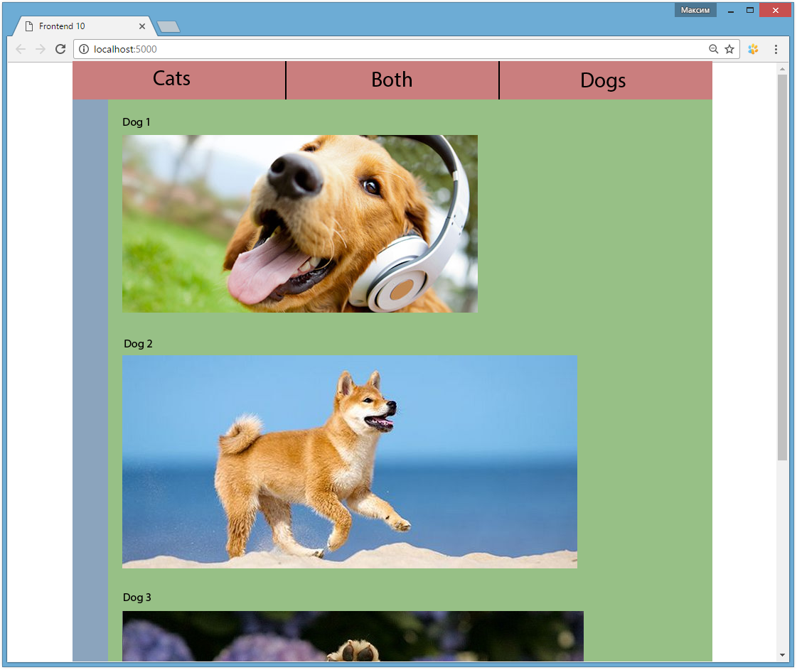

# Practice 11
## Objective
1. Learn to apply animation not only to certain elements, but also to significant parts of layout.
2. Strengthen your skill of interacting with JavaScript code and web page elements.

## Result
You have to create a page with two columns, each of which has its own content. At the top of the page there are several buttons that affect the way of displaying the columns, either showing or hiding them. Transitions between the states should be implemented with animations: the width of a column should alter smoothly, the content should show up/disappear smoothly as well. For animation implementation we advise you to use a CSS property "transition" in combination with addition/deletion of the corresponding classes when clicking on the buttons.

*Pic 1. The initial page state. The page comes to the same state after clicking on the button "Both".*

*Pic 2. The state of the page after clicking on the "Cats" button.*

*Pic 3. The state of the page after clicking on the "Dogs" button.*

## Reference

### JavaScript

#### Elemen
* classList.add
* classList.remove
* classList.contains

## Sources
[http://google.com/](http://google.com/)