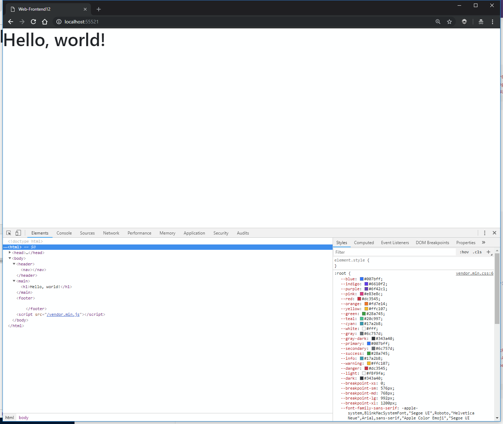

# Practice 12

## Objective

You have to implement a web page with the set of pictures and animations given below, using the Bootstrap 4 framework.

## Sources

You are given the "Hello World" template with all required files included. You might need to create `.js` and `.css` files and a folder for media files. Your should see the following template:

*Рис. 1. The initial task template*

## Result

[Click to watch the video](https://git.hits.tsu.ru/Subject-WebInt/WebInt-Frontend-Manual/blob/master/Frontend12/media/Result-1.mp4)

*Video 1. Demonstration of the main layout and its behavior*

You can see the main page structure in the video above:

1. A navigation bar with a text logo and a menu which items forward you to the page elements
2. A stretched to the maximum width "hero-content" containing an image that adapts its height/width, and a readable text centered vertically and horizontally
3. A new user registration form
4. A segment with messages from website users
5. Sticky footer implemented by flexbox

Pay attention to how the page transforms when the browser window width changes. The elements restructure themselves, change their position, some of them simply disappear.

[Click to watch the video](https://git.hits.tsu.ru/Subject-WebInt/WebInt-Frontend-Manual/blob/master/Frontend12/media/Result-2.mp4)

*Video 2. The mobile version behavior, clearing the registration form data.*

For this video, pay attention to:

1. How the menu behaves on mobile devices, its usability
2. The functionality of clearing the registration form data

[Click to watch the video](https://git.hits.tsu.ru/Subject-WebInt/WebInt-Frontend-Manual/blob/master/Frontend12/media/Result-3.mp4)

*Video 3. Filling in the form, displaying the modal window.*

Pay attention to the following aspects:

1. Changing the standard way of work of the "Save changes" button (request is not being not sent)
2. Responsiveness of the created modal window, its positioning, the darkened area. It should be possible to close the window by both clicking on the outside area and clicking on the "cross" icon
3. The form validation doesn't happen

## Reference

### Bootstrap (Basics)

- Grid concept [https://getbootstrap.com/docs/4.0/layout/grid/](https://getbootstrap.com/docs/4.0/layout/grid/)
    + Columns concept [Picture](https://git.hits.tsu.ru/Subject-WebInt/WebInt-Frontend-Manual/blob/master/Frontend12/media/bootstrap-gird.jpg)
    + Breakpoint system explanation 
    [https://getbootstrap.com/docs/4.0/layout/grid/#grid-options](https://getbootstrap.com/docs/4.0/layout/grid/#grid-options)
    + "Mix and match" [https://getbootstrap.com/docs/4.0/layout/grid/#mix-and-match](https://getbootstrap.com/docs/4.0/layout/grid/#mix-and-match)
    + Nesting [https://getbootstrap.com/docs/4.0/layout/grid/#nesting](https://getbootstrap.com/docs/4.0/layout/grid/#nesting)
    + Alignment [https://getbootstrap.com/docs/4.0/layout/grid/#alignment](https://getbootstrap.com/docs/4.0/layout/grid/#alignment)
    + Reordering [https://getbootstrap.com/docs/4.0/layout/grid/#reordering](https://getbootstrap.com/docs/4.0/layout/grid/#reordering)
    + Offsetting columns [https://getbootstrap.com/docs/4.0/layout/grid/#offsetting-columns](https://getbootstrap.com/docs/4.0/layout/grid/#offsetting-columns)

- Media objects [https://getbootstrap.com/docs/4.0/layout/media-object/](https://getbootstrap.com/docs/4.0/layout/media-object/)
    + Nesting [https://getbootstrap.com/docs/4.0/layout/media-object/#nesting](https://getbootstrap.com/docs/4.0/layout/media-object/#nesting)
    + Media list [https://getbootstrap.com/docs/4.0/layout/media-object/#media-list](https://getbootstrap.com/docs/4.0/layout/media-object/#media-list)

- Used components
    + Navbar [https://getbootstrap.com/docs/4.0/components/navbar/](https://getbootstrap.com/docs/4.0/components/navbar/)    
    + Forms [https://getbootstrap.com/docs/4.0/components/forms/](https://getbootstrap.com/docs/4.0/components/forms/)
    + Alerts [https://getbootstrap.com/docs/4.0/components/alerts/](https://getbootstrap.com/docs/4.0/components/alerts/)    
    + Buttons [https://getbootstrap.com/docs/4.0/components/buttons/](https://getbootstrap.com/docs/4.0/components/buttons/)
    + Modal windows [https://getbootstrap.com/docs/4.0/components/modal/](https://getbootstrap.com/docs/4.0/components/modal/)
    
- Used methods
    + Color change [https://getbootstrap.com/docs/4.0/utilities/colors/](https://getbootstrap.com/docs/4.0/utilities/colors/)
    + Spacing [https://getbootstrap.com/docs/4.0/utilities/spacing/](https://getbootstrap.com/docs/4.0/utilities/spacing/)
    + Text alignment [https://getbootstrap.com/docs/4.0/utilities/text/](https://getbootstrap.com/docs/4.0/utilities/text/) [https://getbootstrap.com/docs/4.0/utilities/vertical-align/](https://getbootstrap.com/docs/4.0/utilities/vertical-align/)

Background information. The teacher's implementation took:

- ~200 html lines
- 60 css lines
- 20 js lines

The numbers are given as a reference to demonstrate the framework usefulness. They shouldn't be taken as a certain "goal" you need to strive for; there's no need to try to write the same number of code lines or surpass it.

### Font Awesome

Icons library, loaded and used as a font.

- Icons search [https://fontawesome.com/icons?d=gallery](https://fontawesome.com/icons?d=gallery)
- Icons sizing [https://fontawesome.com/how-to-use/on-the-web/styling/sizing-icons](https://fontawesome.com/how-to-use/on-the-web/styling/sizing-icons)
- Icons styling [https://fontawesome.com/how-to-use/on-the-web/referencing-icons/basic-use#with-your-styling](https://fontawesome.com/how-to-use/on-the-web/referencing-icons/basic-use#with-your-styling)

### Other methods

Sticky Footer - the flexbox implementation
- [https://css-tricks.com/couple-takes-sticky-footer/#article-header-id-3](https://css-tricks.com/couple-takes-sticky-footer/#article-header-id-3)