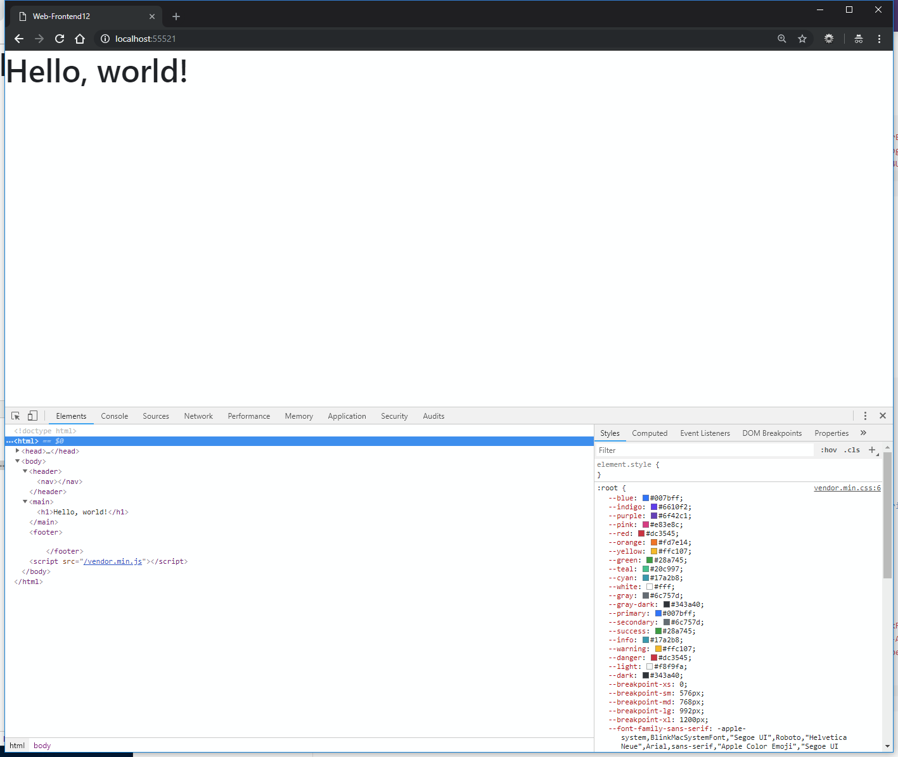
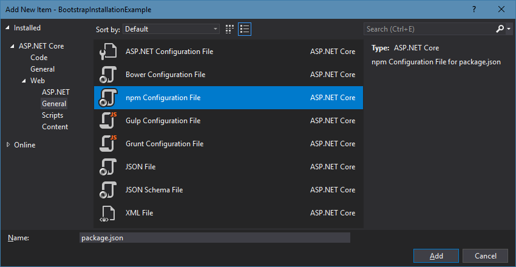
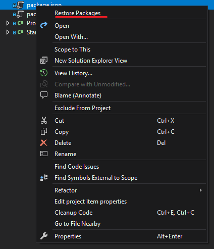
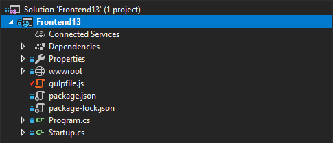
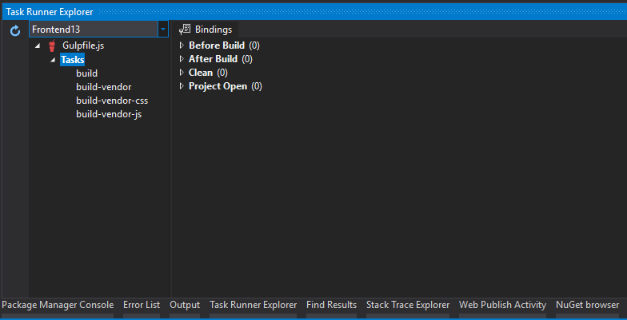

# Practice 13

## Objective

You have to implement a web page with the set of pictures and animations given below, using the Bootstrap 4 framework.
During your implementation you will need to install packages from npm and bundle them together with gulp. Moreover, we offer you to try yourself in using SASS. We will use gulp for compiling it to CSS.

## Sources

You are given the "Hello World" template with all required files included. You might need to create .js and .css files and a folder for media files. Your should see the following template:


*Pic. 1. The initial task template.*

## Result

[Click to watch the video](https://git.hits.tsu.ru/Subject-WebInt/WebInt-Frontend-Manual/blob/master/Frontend13/media/Result-1.mp4)

*Video 1. Demonstration of the main layout and its behavior.*

Video above demonstrates basic page structure:

1. Presence of the header, carousel, nested cards elements. Absence of the footer.
2. How the pages work, click through, animate

[Click to watch the video](https://git.hits.tsu.ru/Subject-WebInt/WebInt-Frontend-Manual/blob/master/Frontend13/media/Result-2.mp4)

*Video 2. Page behavior, difference between pages, collapsing.*

You should take notice of following nuances on this video:

1. Collapse\Expand cards list
2. Different cards styling: background color, text style, image size
3. On the second page main text is in bold
4. On the third page there is a text added with an after-element

[Click to watch the video](https://git.hits.tsu.ru/Subject-WebInt/WebInt-Frontend-Manual/blob/master/Frontend13/media/Result-3.mp4)

*Video 3. Mobile version behavior.*

Pay attention to:

1. Carousel display on viewport size change
2. Grid display on viewport size change
3. Cards content display on viewport size change

## Reference

### NPM Packages

In order to add packages we need a configuration file, template is embedded in Visual Studio.



*Pic. 2. Creating npm configuration file.*

You should create this file in the project root. To add Bootstrap 4 the file should contain following lines:

```js
{
  "version": "1.0.0",
  "name": "asp.net",
  "private": true,
  "devDependencies": {
    "bootstrap": "4.1.3",
    "jquery": "3.3.1",
    "popper.js": "1.14.5"
  }
}
```

Package restore will be ran each time the solution is built. All packages will end up in the `node_modules` in the root folder.

If you want to test the correctness of the package restore - you can run this process manually:



*Pic. 3. npm package restore.*

### Gulp

We are going to use three capabilities provided by Gulp: bundling, minification, sass compilation.

> [!WARNING]
> Adding gulp package to the project will result in several hundred packages being resolved and downloaded to your local machine. Bearing in mind the speed of TSU WiFi network - it might take you a while. The total size of `node_modules` is ~28 Mb.

To enable Gulp we need to add a specific file to the project root:



*Pic. 4. gulp file location.*

After adding it we need to modify the contents of both
`package.json` and `gulpfile.js`

`package.json` - add packages `gulp`, `gulp-concat`:

```js
"gulp": "3.9.1",
"gulp-concat": "2.6.1",
```

The `gulpfile.js` contents is basically JavaScript syntax and is interpreted as such by Gulp:

```js
const gulp = require("gulp");
const concat = require("gulp-concat");

const vendorStyles = [
    "node_modules/bootstrap/dist/css/bootstrap.min.css"
];
const vendorScripts = [
    "node_modules/jquery/dist/jquery.min.js",
    "node_modules/popper.js/dist/umd/popper.min.js",
    "node_modules/bootstrap/dist/js/bootstrap.min.js",
];

gulp.task("build", ["build-vendor"]);

gulp.task("build-vendor", ["build-vendor-css", "build-vendor-js"]);

gulp.task("build-vendor-css", () => {
    return gulp.src(vendorStyles)
        .pipe(concat("vendor.min.css"))
        .pipe(gulp.dest("wwwroot/styles"));
});

gulp.task("build-vendor-js", () => {
    return gulp.src(vendorScripts)
        .pipe(concat("vendor.min.js"))
        .pipe(gulp.dest("wwwroot/scripts"));
});
```

After performing aforementioned actions you can open "Task Runner Explorer" window in Visual Studio. This will help you navigate through tasks in the manager, and launch them from the GUI:



*Pic. 5. Task Runner Explorer windows interface.*

You will need to run `build` task once after you add Bootstrap to your packages - to create `vendor js and css files.

### SASS - Syntactically awesome style sheets

SASS - is a language that helps simplify the development process by speeding up work with CSS. It also eases the support of the styles later on.

Main advantage of SASS, however, is the fact that it is compiled to CSS with no extra requirements to the browsers.

#### Installation

For SASS compilation we will use Gulp. First of all - let's add the package to `packages.json`:

```js
"gulp-sass": "3.1.0",
```

Now - enable the package and create the Gulp task:

```js
const sass = require("gulp-sass"); // Add to the top
...

gulp.task("sass", function () {
    return gulp.src("wwwroot/styles/**/*.scss")
        .pipe(sass().on("error", sass.logError))
        .pipe(gulp.dest("wwwroot/styles"));
});
```

This task, when completed, will compile all the SASS files and will put resulting css files in the `wwwroot/styles` directory. They will not be bundled - this is useful during development.

To ease the development process even further, lets add two more tasks:

1. Modify the `build` task by adding sass compilation to it
2. Use `--watch` flag to automatically run the task when the sass files are changed. This will allow us to run the solution once and avoid manually running the compilation each time we change sass code.

```js
gulp.task("build", ["build-vendor", "sass"]);
```

```js
gulp.task("sass:watch", function () {
    gulp.watch("wwwroot/styles/**/*.scss", ["sass"]);
});
```

#### Language description

General description: [https://sass-lang.com/](https://sass-lang.com/)
Beginners manual: [https://sass-lang.com/guide](https://sass-lang.com/guide)

Here is a list of approaches you may want to use during this practice:

- Variables
- Nesting
- Partials/Import
- Operators
- Loops, Conditions [http://thesassway.com/intermediate/if-for-each-while](http://thesassway.com/intermediate/if-for-each-while)

If you want you can also read up on Mixins and Extend/Inheritance functionality and other components. Ultimately it is up to you to decide whether or not you want to use SASS, but we strongly recommend trying it out and getting a hang of setting it up - it may help you during your midterm exam.

### Bootstrap (Additional components)

- Cards [https://getbootstrap.com/docs/4.0/components/card/](https://getbootstrap.com/docs/4.0/components/card/)
- Carousel [https://getbootstrap.com/docs/4.0/components/carousel/](https://getbootstrap.com/docs/4.0/components/carousel/)
- Pagination [https://getbootstrap.com/docs/4.0/components/pagination/](https://getbootstrap.com/docs/4.0/components/pagination/)
- Collapse[https://getbootstrap.com/docs/4.0/components/collapse/](https://getbootstrap.com/docs/4.0/components/collapse/)

#### Background information. Teacher's implementation took

- 100 html lines
- 60 sass lines
- 60 js lines
- 50 config lines

The numbers are given as a reference to demonstrate the framework usefulness. They shouldn't be taken as a certain "goal" you need to strive for; there's no need to try to write the same number of code lines or surpass it.