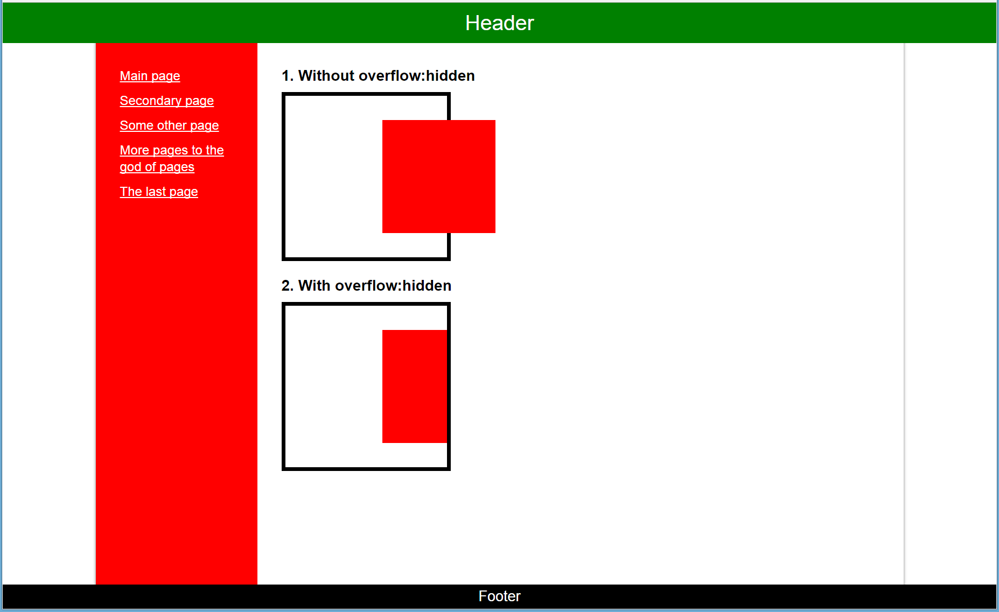
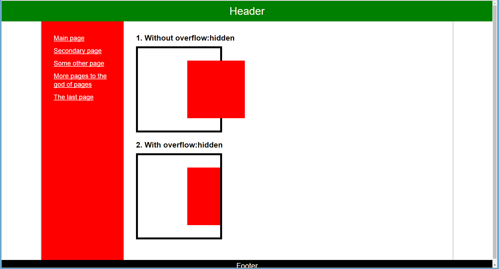
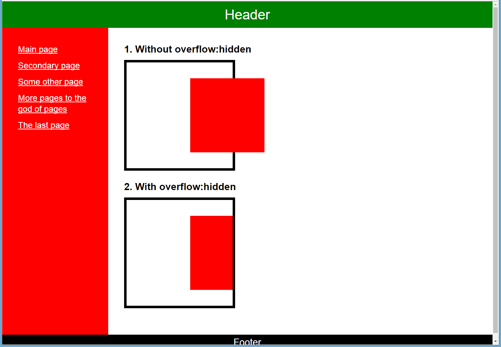
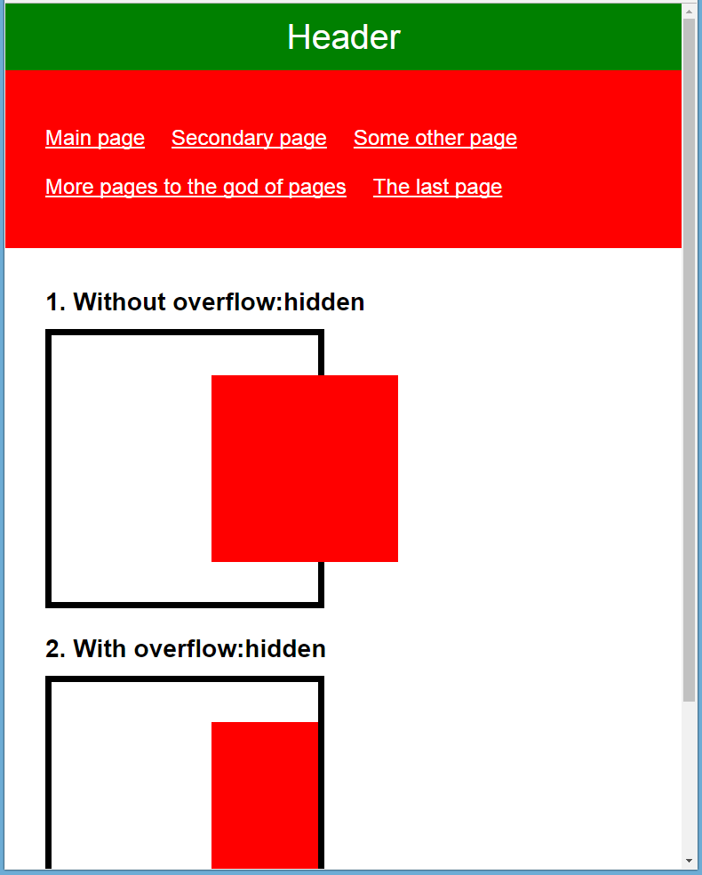

# Practice 3

## Objectives
1. Learn to create more complicated layouts. Grasp a few more advanced techniques for creating layouts.
2. Understand the basic principles of "responsive" web design.
3. Learn how to use pseudo-elements and start implementing them into your code.

## Result

All the images relate to the same layout, the browser window size is the only thing changing.

## Reference

### HTML
* \<header>
* \<aside>

### CSS

#### Selectors
* .class1.class2
* :before, :after
* :first-child, :last-child, :nth-child()
* :first-of-type, :last-of-type, :nth-of-type()

#### Properties
* list-style
* z-index
* content
* text-decoration
* cursor
* box-shadow

#### Methods
* overflow: hidden - stretch an element to full width that's left after float elements
* absolute positioning relative to an element that is higher in the hierarchy than the parent
* responsive layout with use of media queries 
* how to get rid of space between inline elements (several ways)
* one more clearfix
* use of pseudo-elements :before and :after as additional elements
* sticky footer (several ways)
* url from a website root

## Sources
[http://htmlbook.ru/](http://htmlbook.ru/)

[https://developer.mozilla.org/en-US/docs/Web/CSS/Media_Queries/Using_media_queries](https://developer.mozilla.org/en-US/docs/Web/CSS/Media_Queries/Using_media_queries)

[https://css-tricks.com/fighting-the-space-between-inline-block-elements/](https://css-tricks.com/fighting-the-space-between-inline-block-elements/)

[http://nicolasgallagher.com/micro-clearfix-hack/](http://nicolasgallagher.com/micro-clearfix-hack/)

[https://css-tricks.com/couple-takes-sticky-footer/](https://css-tricks.com/couple-takes-sticky-footer/)