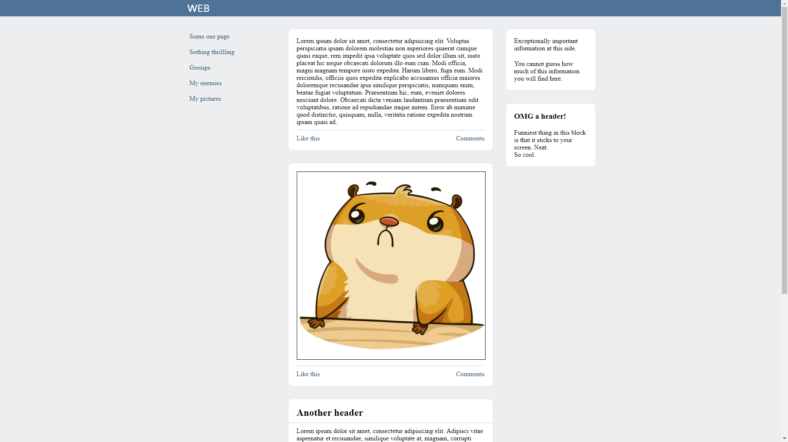
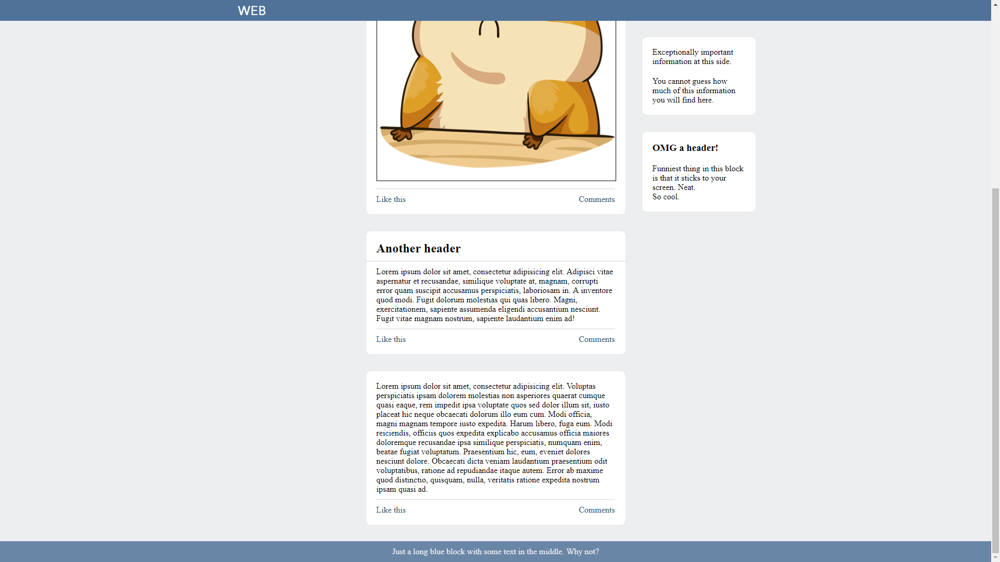
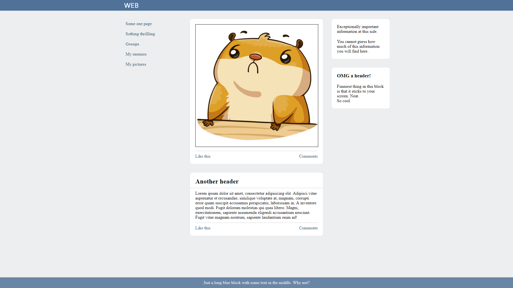
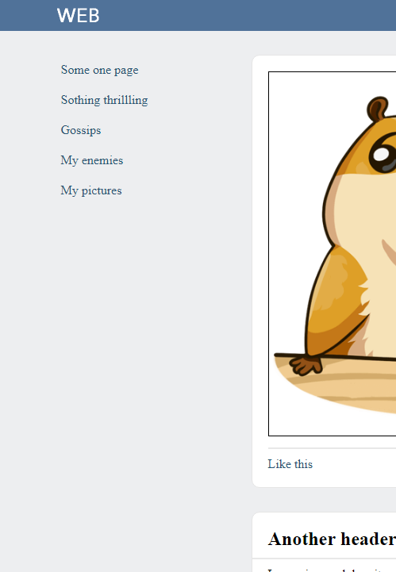
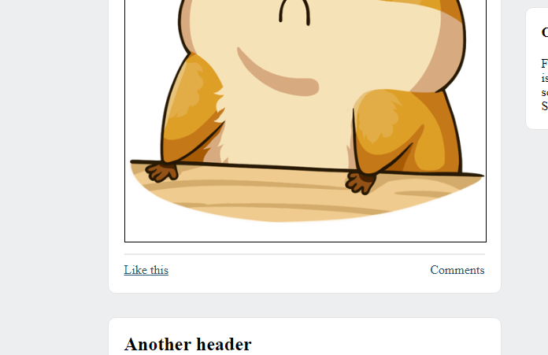
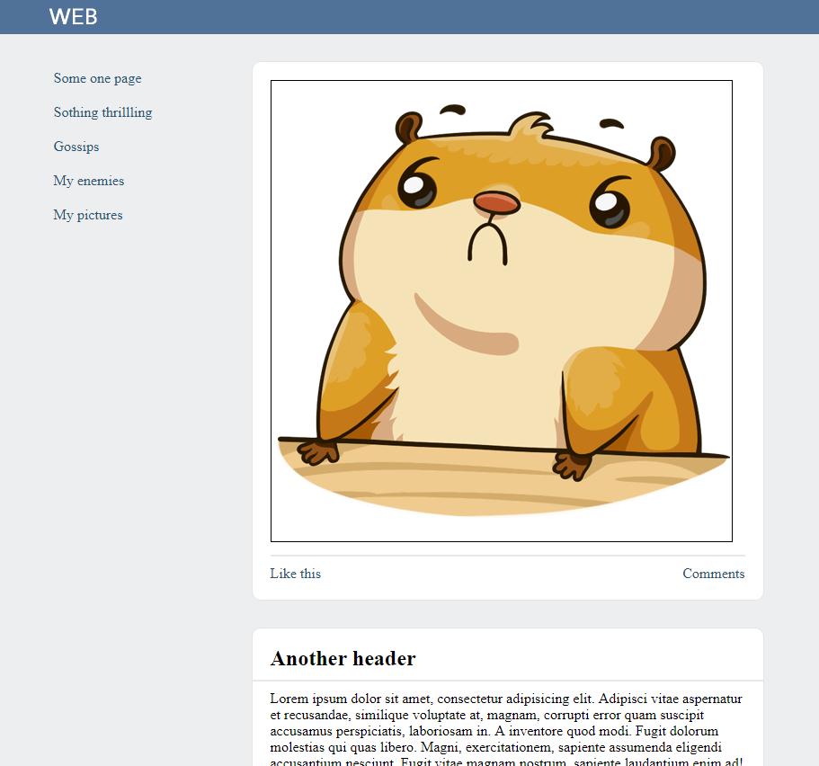
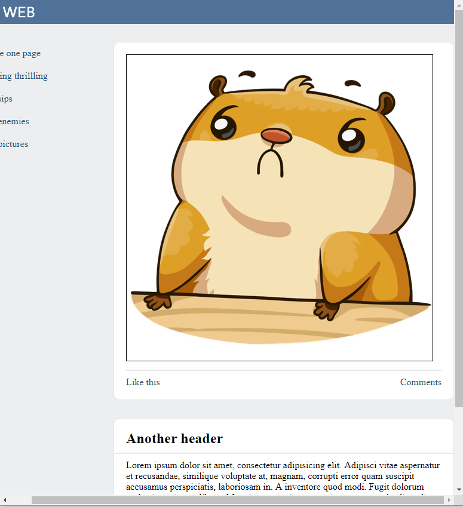

# Practice 4

## Objective
Create a layout by yourself with the help of the given set of pictures and the description. A similar kind of task will be given on the practical test.

## Result
Download all the pictures before starting the work. You should be opening them in an image viewer or editor that allows you to display a picture in 100% size. If you don't, you'll get a misleading idea of what the real size of certain elements is. Just like what can be seen right here.

There is a note under each item, that outlines aspects that you should pay attention to. For the entirety of the layout, you should always pay attention to:
* Background and text colors
* Blocks design: rounded corners, border, shadow
* Margins and padding of the block
* Various font sizes, different single-line spacing

*Pic. 1. The basic structure of a layout. The layout width is 1000px. The logo is the picture.*

*Pic. 2. The site header and the right column follow the screen when the user is doing vertical scrolling. A footer is at the bottom of the layout.*

*Pic 3. Sticky footer.*

*Pic 4. Links in the left column when hovered. Links should be implemented by making use of the element `<a>`, also be sure to specify the value `href` (if you don't want to think out a real link, you can use `href="#"`).*

*Pic 5. Buttons in news feed also change their presentation when being hovered (underlining, "pointing" cursor, as with links). Don't use the `<a>` tag for implementation.*

*Pic 6. The right column should disappear when the width of the browser window is decreased. Horizontal scrolling should not appear. The header should continue to move during vertical scrolling.*

*Pic 7. With further decrease of the width of the browser window, the layout should stop shrinking. Instead of that, the horizontal scrolling should show up. The website header must move horizontally during horizontal scrolling, however, it might no longer move during vertical scrolling. But it would be great if you found a way to make the header continue to move during vertical scrolling (of course, not forgetting about horizontal scrolling).*

## Reference

### CSS

#### Selectors
* :hover

#### Properties
* border-radius

## Sources
[http://htmlbook.ru/](http://htmlbook.ru/)