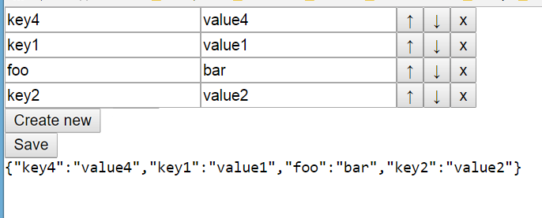

# Practice 8
## Objective
1. Learn to get the parent element, siblings elements and the nested elements list. 
2. Learn to create new elements, add them to a certain position of DOM, remove elements from the page.

## Result
You have to create a dynamic list that allows you to define "key-value" pairs by filling in two fields.
1. Neighboring elements are swappable by using "up" and "down" arrow keys. 
2. Elements can be removed from the page by pressing the "close" button.
3. Elements can be added to the list (always to its end) by pressing the "Create new" button.
4. The "save" button generates a string interpretation of the object that was obtained on the data filled in the fields.

## Reference

### HTML
* \<input type="text">

### JavaScript

#### Document
* createElement(tagName)

#### Element
* className
* classList (classList.add, classList.remove)
* %HTMLAttributeName%
* previousElementSibling
* nextElementSibling
* parentElement
* children
* appendChild(newNode)
* insertBefore(newNode, referenceNode)
* removeChild(node)
* remove()

#### functions
* JSON.stringify(object)
* Object.keys(object)

## Sources
[http://www.learn-js.org/](http://www.learn-js.org/)